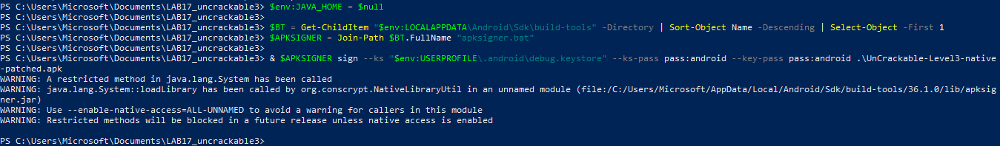

# 🔐 LAB 17 — OWASP UnCrackable Android Level 3


## 📌 Présentation du laboratoire

Ce laboratoire porte sur l’analyse et le contournement des protections de l’application **OWASP UnCrackable Android Level 3**.

L’objectif est de comprendre comment une application Android peut combiner du code Java, du code Smali et une librairie native `.so` afin de protéger une vérification de mot de passe.

Le travail réalisé couvre :

- l’analyse statique du code Java avec **Jadx-GUI** ;
- la décompilation et modification Smali avec **apktool** ;
- le contournement des protections root / debug / tampering ;
- l’analyse native de `libfoo.so` avec **Ghidra** ;
- le patch d’une fonction anti-Frida / anti-Xposed ;
- l’extraction du secret grâce à une logique XOR byte par byte.

---

## 🎯 Objectifs pédagogiques

À la fin de ce laboratoire, les compétences suivantes ont été mises en pratique :

- Décompiler une APK Android.
- Identifier les protections Java et natives.
- Modifier du code Smali.
- Recompiler, signer et réinstaller une APK patchée.
- Analyser une librairie native `.so`.
- Comprendre le fonctionnement d’une fonction JNI.
- Identifier une vérification XOR.
- Retrouver un secret à partir d’octets chiffrés et d’une clé.

---

## 🧰 Outils utilisés

| Outil | Rôle |
|---|---|
| **Android Studio / Emulator** | Exécution et test de l’application |
| **ADB** | Installation, désinstallation et interaction avec l’émulateur |
| **Jadx-GUI** | Décompilation Java de l’APK |
| **apktool** | Décompilation et reconstruction de l’APK |
| **VS Code** | Modification du fichier Smali |
| **Ghidra** | Analyse et patch de la librairie native |
| **Python** | Calcul du secret par XOR |

---

## 📁 Structure du dépôt

```text
LAB17_uncrackable3/
├── screenshots/
│   ├── MainActivity_verifyLibs.png
│   ├── MainActivity_rooting-or-tampering-detected.png
│   ├── MainActivity_System-loadLibrary.png
│   ├── MainActivity-smali_vscode.png
│   ├── code_modifcation_MainActivity-smali_vscode.png
│   ├── apktool_uncrackableL3.png
│   ├── apk_rebuild.png
│   ├── apk_sign.png
│   ├── libfoo-so_import_ghidra.png
│   ├── libfoo-so_analysis_ghidra.png
│   ├── proc-self-maps.png
│   ├── frida.png
│   ├── xposed.png
│   ├── 001037c0_patch_instruction.png
│   ├── instruction_patched.png
│   ├── symbol-tree_codecheck_ghidra.png
│   ├── decompiled_function.png
│   ├── function_FUN_001012c0.png
│   ├── xor_vscode.png
│   └── secret_found.png
├── test.py
├── .gitignore
└── README.md
```
> Les fichiers générés comme les APK, les librairies `.so`, les dossiers apktool et les projets Ghidra ne sont pas versionnés afin de garder le dépôt propre.

---

# 🧩 Étape 1 — Installation et test de l’APK original

L’APK original a d’abord été installée sur l’émulateur avec `adb`.

```bash
adb install -r UnCrackable-Level3.apk
```

L’application s’ouvre avec un champ permettant d’entrer une chaîne secrète.

<p align="center">
  
</p>

---

# 🔎 Étape 2 — Analyse statique avec Jadx-GUI

L’APK est ouverte dans **Jadx-GUI** afin d’observer le code Java décompilé.

Dans `MainActivity`, plusieurs éléments importants apparaissent.

## Vérification d’intégrité

La méthode `verifyLibs()` vérifie les CRC des librairies natives et du fichier `classes.dex`.

<p align="center">
  

</p>

Cette méthode permet de détecter si l’APK ou ses librairies ont été modifiées.

---

## Détection root / debug / tampering

Dans `onCreate()`, l’application vérifie plusieurs conditions :

- détection root ;
- détection debug ;
- vérification d’intégrité ;
- variable `tampered`.

Si une anomalie est détectée, un message d’erreur est affiché.

<p align="center">
  

</p>

---

## Chargement de la librairie native

La ligne suivante montre que la librairie native `libfoo.so` est chargée :

```java
System.loadLibrary("foo");
```

<p align="center">
  

</p>

Cela indique que la vérification réelle du secret est effectuée côté natif.

---

# 🛠️ Étape 3 — Décompilation avec apktool

L’APK est ensuite décompilée avec `apktool`.

```bash
java -jar apktool.jar d -f UnCrackable-Level3.apk -o uncrackable3
```

<p align="center">
  

</p>

Le dossier obtenu contient notamment :

```text
uncrackable3/
├── smali/
├── lib/
├── res/
├── AndroidManifest.xml
└── apktool.yml
```

Le fichier Smali principal se trouve dans :

```text
uncrackable3/smali/sg/vantagepoint/uncrackable3/MainActivity.smali
```

---

# ✏️ Étape 4 — Patch Smali

Le fichier `MainActivity.smali` est ouvert dans VS Code.

<p align="center">
  

</p>

Le bloc responsable de l’affichage du message suivant est identifié :

```text
Rooting or tampering detected.
```

<p align="center">
  

</p>

Le code original appelle la méthode `showDialog()` lorsque root, debug ou tampering est détecté.

Le patch consiste à remplacer l’appel au dialogue par un saut direct vers la suite normale du programme :

```smali
:cond_0
goto :cond_1
```

<p align="center">
 

</p>

Ce patch permet à l’application de continuer son exécution sans afficher le message d’erreur.

---

# 📦 Étape 5 — Reconstruction, signature et installation

Après modification du Smali, l’APK est reconstruite.

```bash
java -jar apktool.jar b uncrackable3 -o UnCrackable-Level3-patched.apk
```

<p align="center">
  

</p>

L’APK est ensuite signée avec `apksigner`.

```bash
apksigner sign --ks "%USERPROFILE%\.android\debug.keystore" UnCrackable-Level3-patched.apk
```

<p align="center">
  

</p>

La signature est vérifiée :

```bash
apksigner verify --verbose UnCrackable-Level3-patched.apk
```

<p align="center">
  

</p>

Puis l’application patchée est installée sur l’émulateur.

```bash
adb uninstall owasp.mstg.uncrackable3
adb install -r UnCrackable-Level3-patched.apk
```

<p align="center">
  

</p>

---

# 🧬 Étape 6 — Analyse native avec Ghidra

Comme l’émulateur utilise l’architecture `x86_64`, la librairie analysée est :

```text
uncrackable3/lib/x86_64/libfoo.so
```

La librairie est importée dans Ghidra.

<p align="center">
  

</p>

Après analyse automatique, Ghidra permet d’explorer les fonctions et les chaînes présentes dans la librairie.

<p align="center">
  

</p>

---

# 🛡️ Étape 7 — Détection anti-Frida / anti-Xposed

Une recherche de chaînes révèle la présence de plusieurs indicateurs de protection :

```text
/proc/self/maps
frida
xposed
```

<p align="center">
  

</p>

<p align="center">
 

</p>

<p align="center">
  

</p>

Les références croisées montrent que ces chaînes sont utilisées dans la fonction :

```text
FUN_001037c0
```

Cette fonction ouvre `/proc/self/maps`, recherche les chaînes `frida` et `xposed`, puis déclenche `goodbye()` si une anomalie est détectée.

<p align="center">
  

</p>

---

# 🧨 Étape 8 — Patch de la fonction native

La fonction `FUN_001037c0` est patchée directement au début.

Instruction originale :

```asm
PUSH RBP
```

Instruction patchée :

```asm
RET
```

<p align="center">
  

</p>

Après patch :

<p align="center">
  

</p>

Ce patch force la fonction à retourner immédiatement, ce qui contourne :

- la lecture de `/proc/self/maps` ;
- la détection Frida ;
- la détection Xposed ;
- l’appel à `goodbye()`.

---

# 💾 Étape 9 — Export de la librairie patchée

Après modification, la librairie est exportée depuis Ghidra au format :

```text
Original File
```

<p align="center">
  

</p>

La librairie patchée est ensuite replacée dans :

```text
uncrackable3/lib/x86_64/libfoo.so
```

<p align="center">
  

</p>

L’APK est reconstruite, signée, puis réinstallée.

<p align="center">
  

</p>

<p align="center">
  
</p>

<p align="center">
  

</p>

---

# 🔐 Étape 10 — Analyse de la fonction de vérification du secret

Dans Jadx, la classe `CodeCheck` montre que la méthode Java appelle une fonction native :

```java
private native boolean bar(byte[] bArr);

public boolean check_code(String str) {
    return bar(str.getBytes());
}
```

<p align="center">
  

</p>

Dans Ghidra, la fonction correspondante est :

```text
Java_sg_vantagepoint_uncrackable3_CodeCheck_bar
```

<p align="center">
  

</p>

La fonction vérifie d’abord que l’entrée utilisateur possède une longueur de `0x18`.

```text
0x18 = 24
```

Le secret doit donc contenir **24 caractères**.

---

# 🧮 Étape 11 — Compréhension du XOR

La fonction native compare chaque octet de l’entrée utilisateur avec le résultat d’un XOR.

La logique peut être résumée ainsi :

```text
input[i] == DAT_00107040[i] XOR local_48[i]
```

Donc, pour retrouver le secret :

```text
secret[i] = DAT_00107040[i] XOR local_48[i]
```

<p align="center">
  

</p>

La fonction `FUN_001012c0` génère la clé utilisée dans `local_48`.

<p align="center">
  

</p>

Les trois constantes utilisées représentent 24 octets au total :

```text
3 blocs × 8 octets = 24 octets
```

Comme l’architecture est `x86_64`, les valeurs sont stockées en little-endian.

La clé obtenue est :

```text
1d 08 11 13 0f 17 49 15
0d 00 03 19 5a 1d 13 15
08 0e 5a 00 17 08 13 14
```

---

# 🐍 Étape 12 — Script Python de calcul du secret

Le script Python applique le XOR entre les octets de `DAT_00107040` et la clé générée dans `local_48`.

```python
dat = bytes.fromhex(
    "70 69 7a 7a 61 70 69 7a "
    "7a 61 70 69 7a 7a 61 70 "
    "69 7a 7a 61 70 69 7a 7a"
)

key = bytes.fromhex(
    "1d 08 11 13 0f 17 49 15 "
    "0d 00 03 19 5a 1d 13 15 "
    "08 0e 5a 00 17 08 13 14"
)

secret = bytes([d ^ k for d, k in zip(dat, key)])
print(secret.decode())
```

<p align="center">
  

</p>

Le résultat obtenu est :

```text
making owasp great again
```

---

# ✅ Résultat final

Le secret est saisi dans l’application :

```text
making owasp great again
```

L’application confirme que le secret est correct.

<p align="center">
  

</p>

---

# 🧠 Résumé technique

| Étape | Résultat |
|---|---|
| Analyse Java | Identification de `verifyLibs()`, `showDialog()` et `System.loadLibrary("foo")` |
| Patch Smali | Contournement du message root / tampering |
| Rebuild APK | APK reconstruite avec apktool |
| Signature | APK signée avec apksigner |
| Analyse native | Identification de `FUN_001037c0` |
| Patch natif | Remplacement de la première instruction par `RET` |
| Analyse du secret | Identification de `CodeCheck_bar` |
| XOR | Extraction du secret final |
| Validation | Message `Success! This is the correct secret.` |

---

# 📌 Commandes principales utilisées

```bash
adb devices
adb shell getprop ro.product.cpu.abi
adb install -r UnCrackable-Level3.apk
```

```bash
java -jar apktool.jar d -f UnCrackable-Level3.apk -o uncrackable3
```

```bash
java -jar apktool.jar b uncrackable3 -o UnCrackable-Level3-patched.apk
```

```bash
apksigner sign --ks "%USERPROFILE%\.android\debug.keystore" UnCrackable-Level3-patched.apk
```

```bash
adb uninstall owasp.mstg.uncrackable3
adb install -r UnCrackable-Level3-patched.apk
```

---

# ⚠️ Remarque

Ce travail a été réalisé dans un cadre académique, sur une application volontairement vulnérable fournie par OWASP pour l’apprentissage de la sécurité mobile.

L’objectif est uniquement pédagogique :

- comprendre les protections Android ;
- apprendre l’analyse statique et native ;
- manipuler les outils de reverse engineering ;
- documenter une démarche de sécurité offensive encadrée.

---

# 🏁 Conclusion

Ce laboratoire montre comment une application Android peut utiliser plusieurs couches de protection : Java, Smali, vérification d’intégrité, détection d’environnement suspect et logique native.

Grâce à l’analyse avec Jadx, apktool et Ghidra, il a été possible de :

- contourner les protections Java ;
- patcher une fonction native ;
- comprendre la logique XOR ;
- retrouver le secret final ;
- valider le résultat dans l’application.

Le secret final obtenu est :

```text
making owasp great again
```
